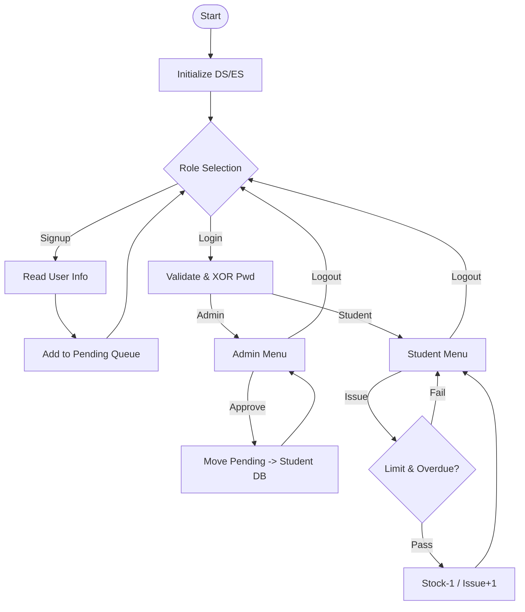

# SEE Exam Guide: Library Management System (`library_management_system.asm`)

This document serves as a comprehensive technical guide and writeup for the Enhanced Library Management System. It covers the problem statement, data structure choices, algorithmic implementation, and system logic tailored for 8086 Assembly.

---

## 1. Problem Statement
The goal is to design a secure, role-based Library Management System that:
-   **Implements Role-Based Access Control (RBAC)** for Admin and Student accounts.
-   **Manages a Pending Approval Workflow** for student registration to ensure data integrity.
-   **Secures sensitive data** using basic cryptographic principles (XOR cipher).
-   **Tracks book circulation** with a 7-day deadline system and issuance limits.
-   **Handles dynamic queue management** for signup requests and book suggestions.

---

## 2. Technical Roadmap (Steps & Data Structures)

### A. Data Structures: Implementation vs. Theory
| Project Feature | Implementation Name | DSA Concept | Why this choice? |
| :--- | :--- | :--- | :--- |
| **User Databases** | `student_ids[50]` | **Static Parallel Arrays** | 8086 addressing is easiest with contiguous blocks; parallel arrays avoid complex struct padding. |
| **Signup Queue** | `request_ids[25]` | **Linear Queue** | Simplifies management for a small number of requests (MAX=5). |
| **Book Inventory** | `book_names[105]` | **Fixed-Size Buffer** | Allows $O(1)$ access to book records using calculated offsets (Index * 15). |
| **Issue Tracking** | `issue_bookno[20]` | **Relational Table** | Maps User IDs to Book IDs with associated deadline metadata. |
| **Password Storage** | `student_pwds[50]` | **Encrypted Array** | Stores XOR-masked bytes to prevent clear-text exposure in memory dumps. |

### B. Segment Definitions (The Data Layer)
```assembly
; Data Containers for System Management
student_count  db 0               ; 8-bit counter
student_ids    db 50 dup(?)       ; 10 students * 5 chars each
student_status db 10 dup(0)       ; 0=Inactive, 1=Active

; Book Database
MAX_BOOKS      equ 10             ; Constant definition
book_names     db 'C Programming  ' ; Fixed 15-char width for alignment
book_stock     db 5, 3, 2         ; Stock levels
```

### C. Execution Pipeline
1.  **Bootstrapping**: Initialize `DS` and `ES` segments; display splash screen.
2.  **Identity Management**: User chooses Login or Signup.
3.  **Signup Workflow**: Collect User ID, Email, Name, and Password; move to `pending` queue.
4.  **Admin Intervention**: Admin reviews requests, approves (moves to `student_ids`), or rejects (removes).
5.  **Session Loop**: Depending on `user_role`, display Admin or Student menu.
6.  **Transaction Logic**: Update `book_stock` and `issue_count` upon successful lending/returning.

---

## 3. Algorithmic Deep Dive

### A. String Comparisons (Validation)
-   **Purpose**: Validating User IDs and Passwords.
-   **Process**:
    1. Load source `SI` and destination `DI`.
    2. Set `CX` to the fixed length (e.g., 5).
    3. Use `repe cmpsb` to check for equality.
    4. Check Zero Flag (`ZF`) to determine the result.

### B. Queue Management (The Selection & Shift Logic)
When an item is removed (e.g., approving a request or returning a book):
-   **Extraction**: Locate the target index ($I$).
-   **Shifting**: Iterate from $I$ to $N-1$, moving the element at $I+1$ to position $I$.
-   **Maintenance**: Decrement the global counter (`request_count` or `issue_count`).
-   **Complexity**: $O(N)$ for single deletions in static arrays.

### C. XOR Cipher (Security)
The system uses the XOR logical operation for reversible "encryption":
`EncryptedByte = PlaintextByte XOR 'X'`
-   **Why XOR?**: It is computationally cheap (one instruction) and symmetrical. Applying the same operation twice restores the original value, meaning the same procedure works for both encryption and decryption.

---

## 4. Discussion: Data Integrity & Error Handling

### The "Overdue" Problem
A student could theoretically hoard books indefinitely if deadlines aren't checked.
-   **Solution**: The `check_overdue_issues` procedure. Before any new book is issued, the system scans the `issue_days` array for the specific user. If any record has `0` days remaining, the system blocks further issuance until the book is returned.

### The "Full Database" Problem
Static allocation in Assembly means finite boundaries.
-   **Solution**: Constant checking (`MAX_STUDENTS`, `MAX_BOOKS`). If `book_count >= MAX_BOOKS`, the "Add Book" feature is disabled, preventing memory corruption into adjacent data segments.

---

## 5. Visual Flowchart (Conceptual Logic)


---

## 6. Exam Tips for Writeup
-   **Memory Addressing**: Explain that offsets are calculated as `Index * RecordSize` (e.g., `MUL` instruction using `AX`).
-   **DOS Interrupts**: Mention `INT 21h` (AH=09h for strings, AH=01h for characters).
-   **Static Arrays**: Note that parallel arrays reduce the need for `lea` calculations within nested structures, saving cycles in 8086.
-   **XOR Property**: State that `(A XOR B) XOR B = A`, making it a perfect symmetrical cipher for simple embedded systems.
